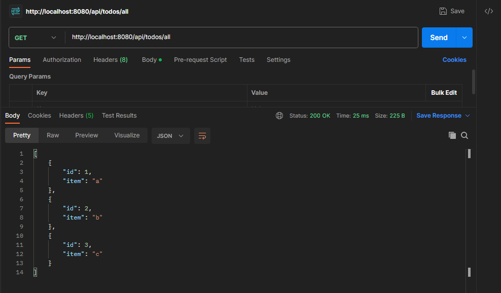
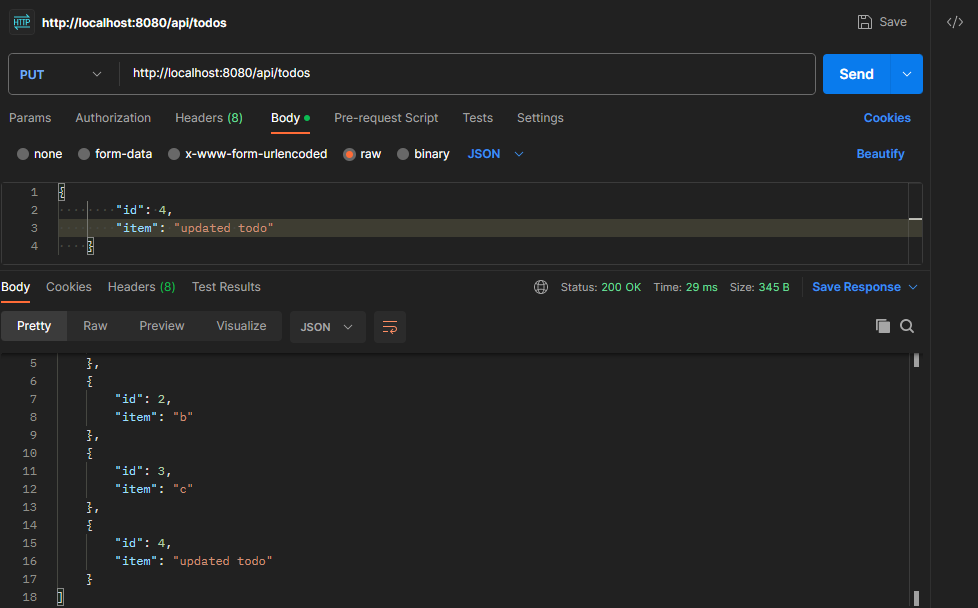
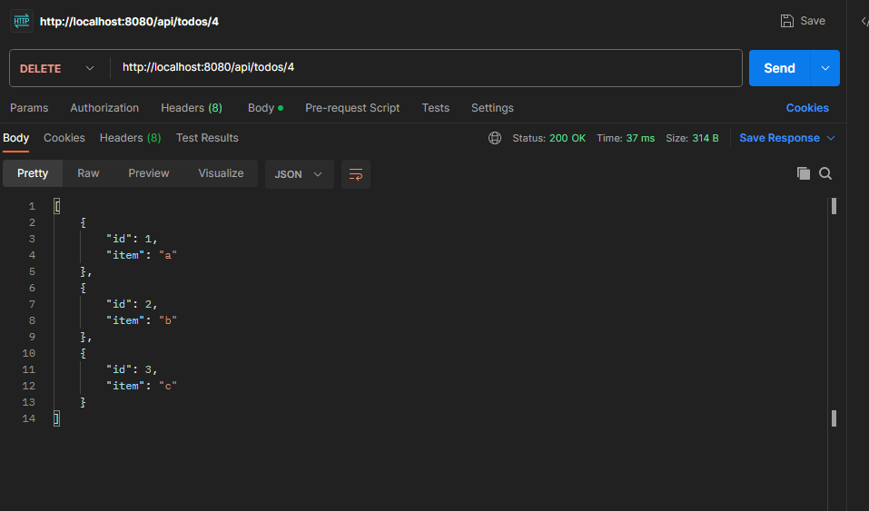

# API Creation Using Springboot and MYSQL.
This project is developed using JAVA V-17.0.8 and Springboot.

Text editor used: INTELLIJ.

Project: Maven based project.
## 🛠 Skills
------------      
    - Springboot
    - Java
    - JDBC Template
    - MYSQL
## OverView of the project:
---------------------------
    Here,We create the backend process to store the data's in Database, it can be accessed through (@RestController) : @RequestMapping, Mapping Methods(GET,PUT,POST,DELETE)
    
## Project Structure
⏩Models:
   - Todo

⏩Controller
   - TodoController
   
⏩Repository
   - TodpRepository

## Dependencies Used
1. spring-boot-starter-web
2. mysql-connector-java
3. spring-boot-starter-jdbc
---------------------------------
## Screenshoots
- METHODS:
    - GET :
  
    
    
    - POST:
    
    

    - PUT:
  
    

    - DELETE:
  
    

